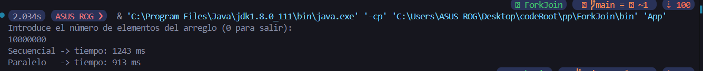
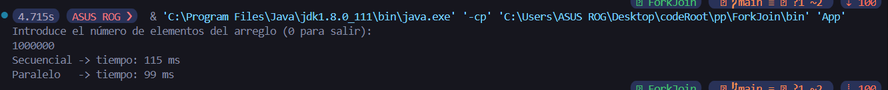
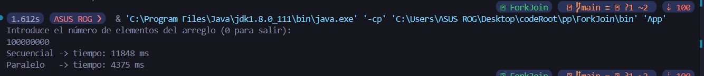

## ForkJoin - T02 - Motta

### Descripción
Este proyecto muestra la implementación de Merge Sort en Java de dos formas:

1. **Secuencial**: usando un único hilo con la clase `SequentialSorter`.
2. **Paralelo**: usando el framework **Fork/Join** con la clase `ParallelMergeSort`.

El objetivo es comparar ambos enfoques midiendo tiempos de ejecución y opcionalmente mostrando los arreglos ordenados.

### Por qué Merge Sort?
Merge Sort es un algoritmo eficiente de ordenamiento basado en la estrategia *divide y vencerás*. Se eligió para este proyecto porque:

- **Eficiencia consistente**: garantiza un rendimiento de O(n log n) en todos los casos.
- **Facilidad de paralelización**: las mitades pueden ordenarse de forma independiente en distintos hilos.

A continuación, se detallan los componentes:

### Componentes

#### 1. `SequentialSorter` (src/problem/SequentialSorter.java)
- Implementa Merge Sort de manera recursiva y secuencial.
- Método público: `sort(int[] array)`.
- Divide el arreglo hasta subranges de tamaño ≤1 y luego fusiona.

#### 2. `ParallelMergeSort` (src/problem/ParallelMergeSort.java)
- Extiende `RecursiveAction` para ordenar "in place".
- Umbral (`MIN_TASK_SIZE`) definido para detener la partición y usar `Arrays.sort` en rangos pequeños.
- En `compute()`, divide el arreglo en dos subtareas, usa `invokeAll(...)` y fusiona los resultados.

#### 3. `App` (src/App.java)
- Lee un entero **n** desde la entrada estándar (solo número).
- Genera un arreglo de tamaño **n** con valores aleatorios entre 0 y 99.
- Ejecuta el ordenamiento secuencial y paralelo, midiendo tiempos con `System.currentTimeMillis()`.
- Si **n ≤ 40**, muestra los arreglos ordenados y los tiempos; si **n > 40**, muestra solo los tiempos.
  
### Comparación de rendimiento
| Versión     | Descripción                            |
|-------------|----------------------------------------|
| Secuencial  | Merge Sort en un solo hilo             |
| Paralelo    | Merge Sort en múltiples hilos (Fork/Join) |

### Resultados
<!-- 

 -->
 
 
 
